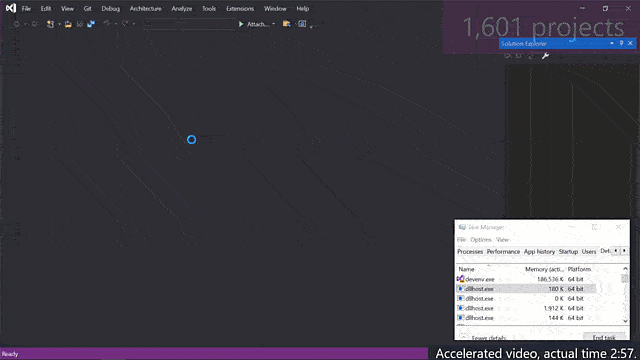
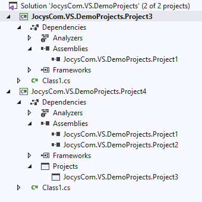
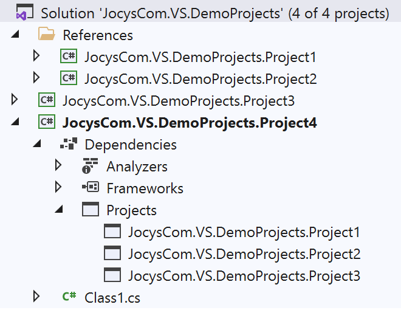
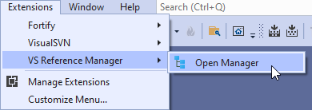
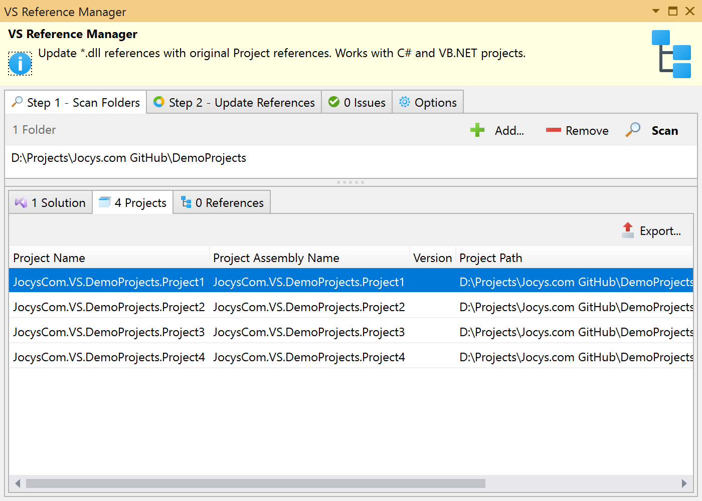
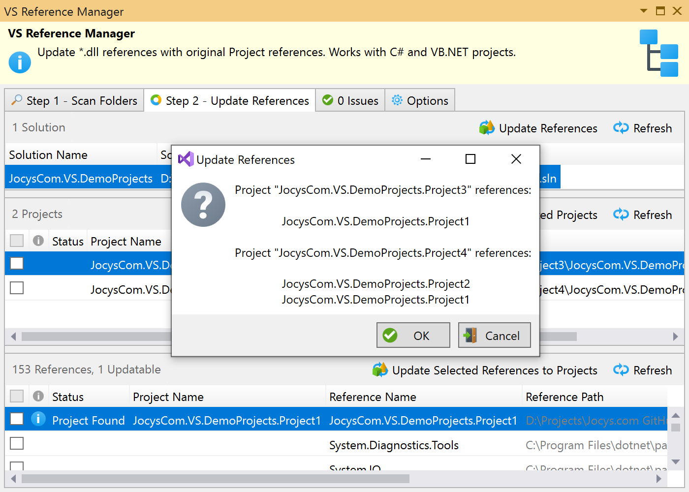

# Jocys.com VS Reference Manager (Microsoft Visual Studio extension)

Update \*.dll references with original Project references. Works with C# and VB.NET projects.

# Download

Download latest version from <a href="https://marketplace.visualstudio.com/items?itemName=JocysCom.JocysComVsReferenceManager">VS Reference Manager - Visual Studio Marketplace</a> or by using Visual Studio Extension Manager.

## Why this extension was created?

A long time ago CPUs and hard drives were much slower. Developers used to split projects into multiple solutions and used DLL references in order for Visual Studio to work faster. Today we have CPUs with more cores and blazing fast solid state drives (SSDs). Developers can load hundreds of projects into one Visual Studio solution, which also is much better for refactoring and debugging. This extension can save time if you want to find and load original projects back into one Solution.

New Visual Studio 2022 is 64-bit. Video of Visual Studio 2022 opening a solution with 1,600 projects and ~300k files:

## How it works

Extension scans specified disk locations for C# (\*.csproj) and VB.NET (\*.vbproj) project files. Then, it will use that data to update \*.dll references with original Project references. During update process, when necessary, original Projects will be automatically added under "References" solution folder. You can find extension settings and data here: C:\ProgramData\Jocys.com\VS Reference Manager\

Before: Projects reference \*.dll assemblies:

After: Projects reference original Projects, which are also included under "References" solution folder:

 ► 

## Screenshots

