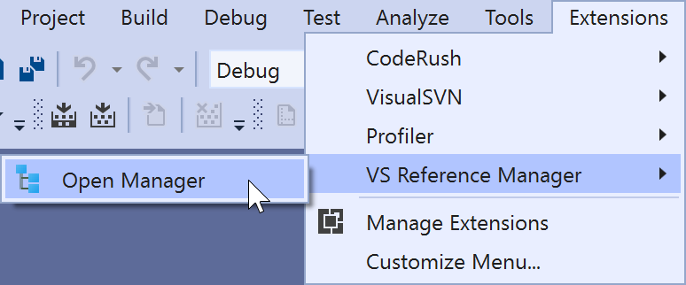

# Jocys.com VS Reference Manager

Update DLL references with Project references. Works with C# and VB.NET projects.

## Why extension was created?

When CPU and hard drivers were much slower, developers used to split projects into multiple solutions. Referencing DLL, instead of projects helped to load Visual Studio Solutions faster. Because of much faster solid state drives (SSDs), developers can load hundreds of projects into one Solution much faster now. Loading all projects is much better for refactoring and debugging. This extension should help to replace old DLLs with the projects inside solution.

## How it works

Extension scans specified locations with projects. Then it will use that date to replace project DLL references with Project references. Projects will be added to solution under "References" solution folder.

## Update DLL references with Project references

Before: Solution's Project4 references two DLL assemblies:

&nbsp;&nbsp;&nbsp;&nbsp;

After: Solution includes two projects and Project4 references them:

&nbsp;&nbsp;&nbsp;&nbsp;

## Screenshots

&nbsp;&nbsp;&nbsp;&nbsp;

&nbsp;&nbsp;&nbsp;&nbsp;
