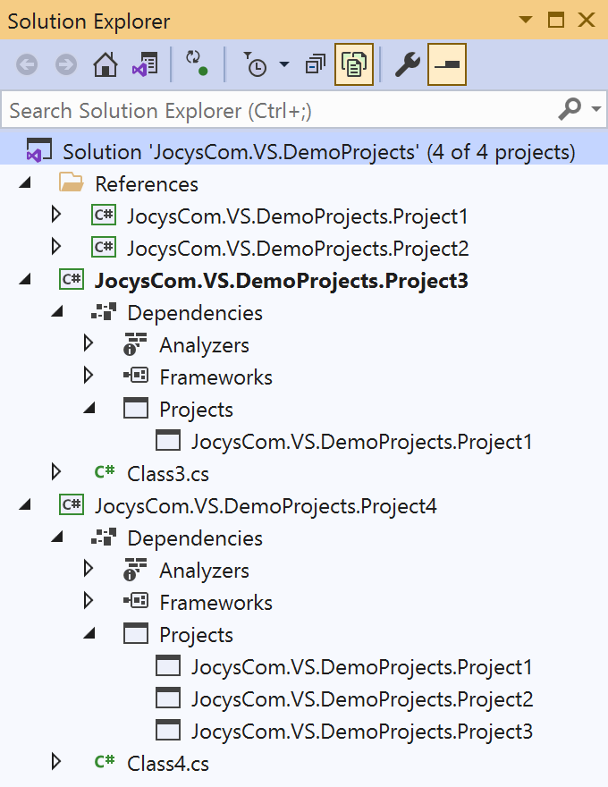

# Jocys.com VS Reference Manager (Microsoft Visual Studio extension)

Update \*.dll references with original Project references. Works with C# and VB.NET projects.

## Why this extension was created?

A long time ago CPUs and hard drives were much slower. Developers used to split projects into multiple solutions and used DLL references in order for Visual Studio to work faster. Today we have CPUs with more cores and blazing fast solid state drives (SSDs). Developers can load hundreds of projects into one Visual Studio solution, which also is much better for refactoring and debugging. This extension can save time if you want to load original projects back into one Solution.

## How it works

Extension scans specified disk locations for C# (\*.csproj) and VB.NET (\*.vbproj) project files. Then, it will use that data to update \*.dll references with original Project references. When necessary, original Projects will be automatically added to under "References" solution folder.
Location of extension's settings and data: C:\ProgramData\Jocys.com\VS Reference Manager\

## Update DLL references with Project references

Before: Solution's Project4 references two DLL assemblies:

&nbsp;&nbsp;&nbsp;&nbsp;

After: Solution includes two projects and Project4 references them:

&nbsp;&nbsp;&nbsp;&nbsp;

## Screenshots

&nbsp;&nbsp;&nbsp;&nbsp;

&nbsp;&nbsp;&nbsp;&nbsp;

&nbsp;&nbsp;&nbsp;&nbsp;
