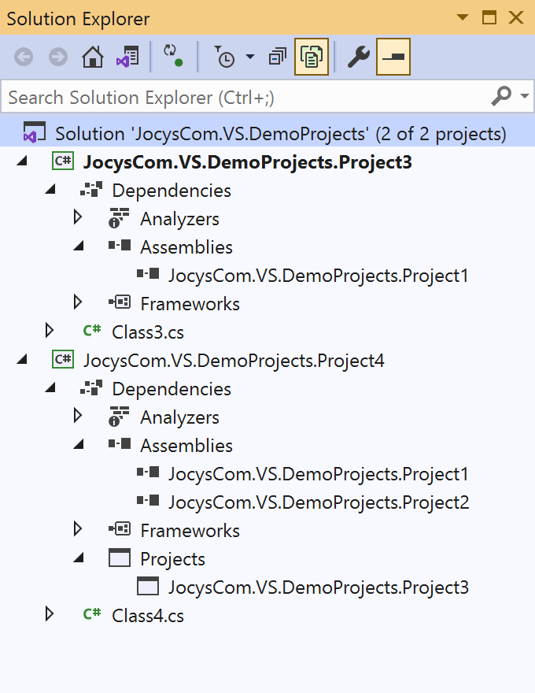

# Jocys.com VS Reference Manager

Update DLL references with Project references.

## How it works

Extension scans specified locations with projects. Then it will use that date to replace project DLL references with Project references. Projects will be added to solution under "References" solution folder.

## Update DLL references with Project references

Before: Solution with Project4, which references two DLL assemblies:

&nbsp;&nbsp;&nbsp;&nbsp;

After: Solution with Project4, which references two Projects:

&nbsp;&nbsp;&nbsp;&nbsp;

## Screenshots

&nbsp;&nbsp;&nbsp;&nbsp;

&nbsp;&nbsp;&nbsp;&nbsp;
